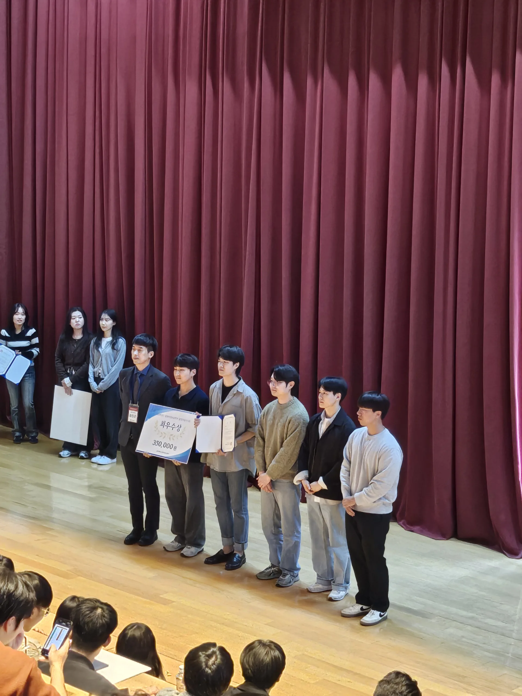

## Silver Winner 수상

**Dongwook Kwon**, 포스터 부문, IBEC 2024.11

- 논문: "Hybrid Neural Network Model for Anomaly Detection in Implantable Devices Using Graph Attention Networks and Transformers"

## 우수 학생 논문상 수상

**Jiseok Yang**, 논문 부문, 대한전자공학회 2024 하계종합학술대회, 2024.06

- 논문: "Large Language Models의 제로샷 기법을 적용한 렌터카 차량 가격 예측"

## 졸업 작품 전시회 최우수상 수상

- **이지운**, **윤성민**, 박준석, 윤영로, 이상현, 신윤석 "나일론머스크"팀 졸업작품전시회 최우수상 수상

## 졸업 작품 전시회 장려상 수상

- 이영준, 최은찬, 이찬호, 김형진 "인공지능어려워요"팀 졸업작품전시회 장려상 수상

<!--more-->
